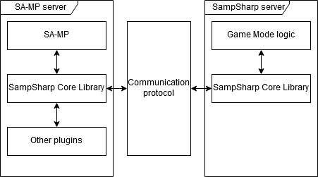
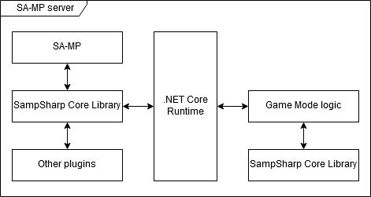

Introduction
--------
There are a few options in SampSharp which allows you to configure certain behaviour of how the server is run. By default SampSharp runs the server with some sane default settings. You can however change these settings if the defaults are causing problems for you.

A few of these options allow you to configure the run mode of SampSharp. There are two run modes: hosted mode (also known as production mode) and multi-process mode (also know as debug mode). The run mode options can be quite advanced and can generally be ignored.

Game Mode Instance
------------------
In order for your game mode to properly function, you need to indicate which
class provides the game mode functionality; a class which implements
`IGameModeProvider`. The `BaseMode` class in the `SampSharp.GameMode` library
implements this interface. Generally you'll want to create a class which
inherits from `BaseMode` and use this class as the game mode provider. By using
the `Use` method you can specify the game mode provider:

``` cs
.Use<MyGameMode>()

// or if you wish to specify the constructor manually:

.Use(new MyGameMode())
```

SampSharp Logging
-----------------
SampSharp provides some logs to show what is going on within SampSharp itself. By using the `.UseLogLevel(logLevel)` method you can change the
minimum level of log messages to appear.  By default, the log
messages are printed to the standard console output. If you wish to change the
output stream, you can use the `.UseLogStream(stream)` method. The following log levels are available:

- `CoreLogLevel.Initialisation` *(highest)*: Only show the messages which appear during the initialization of SampSharp.
- `CoreLogLevel.Error`: Show errors and higher.
- `CoreLogLevel.Warning`: Show warnings and higher.
- `CoreLogLevel.Info` *(default)*: Show information messages and higher.
- `CoreLogLevel.Debug` *(lowest)*: Show all messages, including debug messages.

Redirect Console Output
-----------------------
By using `.RedirectConsoleOutput()` you can forward all data written to the
console using the `System.Console` class to the SA-MP server log. It is however
a better practise to use a logging package from NuGet because there are much better
options for logging other than logging to your `server_log.txt` file. Some
examples of good logging packages are Log4Net, Micosoft.Extensions.Logging or NLog. Redirecting console output should only ever be used for debugging purposes.

Start Behaviour
---------------
In SA-MP, certain actions are only available during OnGameModeInit, such as
adding static vehicles, disabling interiors or setting the player animation
type. Therefore SampSharp needs to be attached to the SA-MP server before the
`OnGameModeInit` callback is called. Please note this is mechanism only takes place in multi-process run mode (debug mode). In hosted run mode (production mode) the .NET Core runtime and your game mode will always be up and running before the game mode is being initialized. The startup behaviour is ignored in hosted run mode.

SampSharp provides a few startup behaviours. You can change the startup behaviour using
`.UseStartBehaviour(GameModeStartBehaviour.FakeGmx)` with your desired startup
behaviour.

### GameModeStartBehaviour.Gmx
A GMX (game mode exchange) RCON command is automatically send to the SA-MP
server, allowing SampSharp to attach before the next `OnGameModeInit` call. Please note that a GMX can take several seconds.

### GameModeStartBehaviour.FakeGmx
A fake GMX is particularly useful while you are developing your game mode.
SampSharp will not send an actual GMX RCON command to the SA-MP server, but will
pretend a `OnGameModeInit` call has been received from the server. After it has
processed this call, it will also call `OnPlayerConnect` for each player already
connected to the server. Using the fake GMX startup behaviour can save you
valuable time during development, because you don't need to restart your game
client every time you restart your server.

Encoding
----
C# uses Unicode for storing text, while SA-MP uses a "byte oriented" charset.
The characters displayed by SA-MP depend on the active localization of the
machine of the player. In SA-MP without SampSharp you might have noticed that
if someone types something in Russian (using a Cyrillic charset), the text
appears as some random symbols on the screen of an English user(using a Latin
charset). This is because the bytes representing symbols in the Cyrillic charset
represent different symbols in the Latin charset.

In order to let characters sent by players represent the same characters on the
server, the characters need to be translated to Unicode. In
order to do this, you will need to specify which character set (encoding) the
server expects to receive. At the moment, SampSharp only supports one encoding
to be active. In order to set the active encoding, you can use
`.UseEncoding(...)`. There are 3 overloads of the `UseEncoding` method:

- `UseEncoding(System.Text.Encoding encoding)`: Using this method you can
  specify an encoding to use. This is particulary useful if you wish to load an
  encoding which is built into .NET.
- `UseEncoding(string filePath)`: Using this method you can load an encoding
  based on an encoding description file.
- `UseEncoding(System.Stream stream)`: Using this method you can load an
  encoding description file from a stream.

A number of encoding description files can be found in the `codepages` folder
inside the archieve which can be downloaded from the
[releases page](https://github.com/ikkentim/SampSharp/releases).

Multi-Process Run Mode
----
In debug mode the SampSharp game mode runs in a process separate from the SA-MP server. This adds overhead (makes the process slower) but makes it much easier to debug your game mode. Because the game mode runs in a separate process you can shut down and restart your game mode without having to shut down the SA-MP server which allows you to keep the game connected to the server. This could save you time while developing, because you don't have to restart the game and SA-MP server over and over again when making changes to your game mode. The [Getting Started](getting-started) guide shows you how to set up a server in debug mode in a few simple steps.



There are a number of communication protocols which can be used to allow the SA-MP server and SampSharp server to communicate with each other. SampSharp has some default settings which should work on every machine. You can however tweak the settings if you would like to experiment with other communication protocols.

### Windows Named Pipe
This is the default protocol on Windows and is only available on Windows. The servers will communicate trough a named pipe with a configurable name. The pipe name can be configured in both servers. By default the pipe name is `SampSharp`. The SampSharp server can only connect to a named pipe on the local server. The pipe name can be configured in the `server.cfg` file for the SA-MP server using the `com_pipe` option. Using the [GameModeBuilder](#gamemodebuilder) you can set the named pipe the SampSharp server will connect to using the `.UsePipe(pipeName)` method.

### Unix Domain Socket
This is the default protocol on Linux and is only available on Linux. The servers will communicate trough a unix domain socket with a configurable socket path. The socket path can be configured in both servers. By default the socket path is `tmp/SampSharp`. The socket path can be configured in the `server.cfg` file for the SA-MP server using the `com_dsock` option. Using the [GameModeBuilder](#gamemodebuilder) you can set the socket path the SampSharp server will connect to using the `.UseUnixDomainSocket(socketPath)` method.

### TCP Socket
The TCP option is only available in the SA-MP server on Linux but is available in the SampSharp server on both Linux and Windows. This allows you to connect your SampSharp server to a SA-MP server on a different (Linux) machine. By default the servers will communicate through port 8888 on the local machine. You can enable the TCP protocol on the SA-MP server by setting `com_type` to `tcp` in the `server.cfg` file. You can change the port and IP which is allowed to connect to the SA-MP server by setting the `com_port` and `com_ip` options. Using the [GameModeBuilder](#gamemodebuilder) you can make your SampSharp server connect to the SA-MP server trough a TCP connection using the `.UseTcpClient(server, port)` method.

Hosted Run Mode
----
In production mode the SampSharp plugin inside the SA-MP server runs a 32-bit .NET Core runtime within the SA-MP server process. This allows for very fast communication between SA-MP and your gamemode because the data does not cross process boundaries. The .NET Core runtime is started allong with the SampSharp plugin.



In order to run in production mode you need to have the 32-bit .NET Core runtime files. See [Running in Production](running-in-production) for some simple steps to getting your game mode to run in production mode.

GameModeBuilder
----
The `GameModeBuilder` class is a utility to set up and configure your game mode
instance, set up the communication with the SA-MP server and to configure some
additional options. The builder should generally be created and run within the
entry-point of your application, which by default is located within the
`Program` class of you console application. A simple default which can also be found in the [Getting Started](getting-started) guide looks as follows:

``` cs
new GameModeBuilder()
    .Use<GameMode>()
    .Run();
```

Each method (except for `Run`) returns the updated game mode builder, which
allows you to chain configuration methods. For example, if you wish to set a
specific minimum log level, you can simply add `UseLogLevel` to the method
chain:

``` cs
new GameModeBuilder()
    .Use<GameMode>()
    .UseLogLevel(CoreLogLevel.Warning)
    .Run();
```
