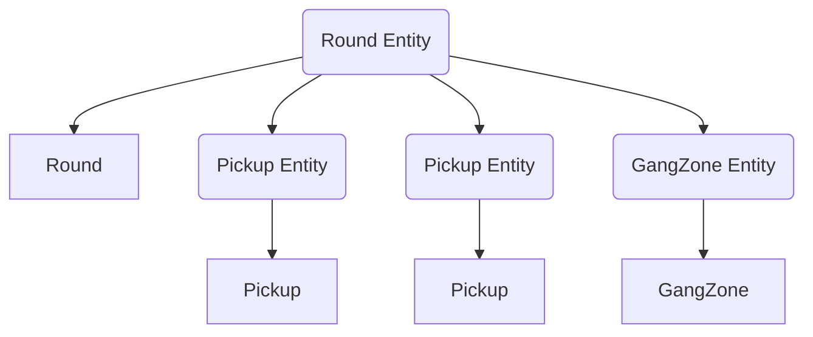

# Entities and Components

In SampSharp, an **entity** is a unique object in the game world, such as a player, vehicle, or object. **Components** are data containers that are attached to entities to define their properties or state. Components should not contain logic or behavior; instead, logic is implemented in systems that operate on entities with specific components. An entity only exists in the ECS world when it has at least one component attached.

Entities and components are the building blocks of the ECS architecture:
- Entities are identified by an `EntityId` (<xref:SampSharp.Entities.EntityId>)
- Components are subclasses of <xref:SampSharp.Entities.Component>
- Systems operate on entities by querying for specific component combinations

## Creating Entities

Entities are created implicitly when you add the first component to a new `EntityId`. You can generate a new entity identifier using:


```csharp
var entityId = EntityId.NewEntityId();
```

To add a component and thus create the entity, use the <xref:SampSharp.Entities.IEntityManager> interface. For example, with a custom component:

```csharp
var myComponent = entityManager.AddComponent<MyFirstComponent>(entityId);
```

- The entity is created when the first component is added.
- You can add more components to the same entity using the same `entityId`.

> [!NOTE]
> Built-in components such as <xref:SampSharp.Entities.SAMP.Player>, <xref:SampSharp.Entities.SAMP.Pickup>, and <xref:SampSharp.Entities.SAMP.Vehicle> are managed by SampSharp and should not be manually added to an entity.

## Creating Custom Components

To create a custom component, simply inherit from <xref:SampSharp.Entities.Component>:

```csharp
public class BankAccount : Component
{
    public decimal Balance { get; set; }
    
    public void Deposit(decimal amount)
    {
        Balance += amount;
    }
    
    public void Withdraw(decimal amount)
    {
        if (amount <= Balance)
            Balance -= amount;
    }
}
```

You can then add your custom component to an entity:

```csharp
var accountComponent = player.AddComponent<BankAccount>();
accountComponent.Deposit(100);
```

## Entity Hierarchy and Nesting


Entities can be organized in a parent-child hierarchy. When you add a component to an entity, you can specify a parent entity:

```csharp
var childId = EntityId.NewEntityId();
entityManager.AddComponent<BankAccount>(childId, parentId);
```

- Destroying a parent entity will recursively destroy all its children and their components.

### Example: round-scoped entities

A common use case for entity hierarchies is **lifetime grouping**: tie a set of transient entities to a single parent, then destroy the parent to clean them all up at once. All `IWorldService.Create*` methods accept an optional `parent` parameter for exactly this.

For example, a deathmatch round that spawns weapon pickups and a control zone can parent everything to a `Round` entity. Destroying that entity at the end of the round removes the pickups and gang zone in one call:



## Destroying Entities and Components

Destroying an entity removes all its components and recursively destroys all child entities.
You can destroy an entity using:

```csharp
entityManager.Destroy(entityId);
```

Or from a component:

```csharp
component.DestroyEntity();
```

You can also destroy a single component:

```csharp
component.Destroy();
```

## Working with Components from a Component

From any <xref:SampSharp.Entities.Component>, you can:
- Get another component on the same entity: `component.GetComponent<OtherComponent>()`
- Add a component to the same entity: `component.AddComponent<OtherComponent>()`
- Get components in children or parent entities: `component.GetComponentInChildren<T>()`, `component.GetComponentInParent<T>()`, etc.

See <xref:SampSharp.Entities.Component> for all available methods.

## Provided Components in SampSharp

Below is a list of the most important components provided by SampSharp:

| Component | Description |
|-----------|-------------|
| <xref:SampSharp.Entities.SAMP.Actor> | Represents an actor (non-movable NPC) in the world |
| <xref:SampSharp.Entities.SAMP.Class> | Represents a player class |
| <xref:SampSharp.Entities.SAMP.GangZone> | Represents a gang zone |
| <xref:SampSharp.Entities.SAMP.GlobalObject> | Represents an object |
| <xref:SampSharp.Entities.SAMP.Menu> | Represents a menu |
| <xref:SampSharp.Entities.SAMP.Npc> | Represents a non-player character |
| <xref:SampSharp.Entities.SAMP.Pickup> | Represents a pickup item |
| <xref:SampSharp.Entities.SAMP.Player> | Represents a player |
| <xref:SampSharp.Entities.SAMP.PlayerGangZone> | Player-specific gang zone |
| <xref:SampSharp.Entities.SAMP.PlayerObject> | Player-specific object |
| <xref:SampSharp.Entities.SAMP.PlayerPickup> | Player-specific pickup |
| <xref:SampSharp.Entities.SAMP.PlayerTextDraw> | Player-specific textdraw |
| <xref:SampSharp.Entities.SAMP.PlayerTextLabel> | Player-specific text label |
| <xref:SampSharp.Entities.SAMP.TextDraw> | Represents a textdraw |
| <xref:SampSharp.Entities.SAMP.TextLabel> | Represents a text label |
| <xref:SampSharp.Entities.SAMP.Vehicle> | Represents a vehicle |
