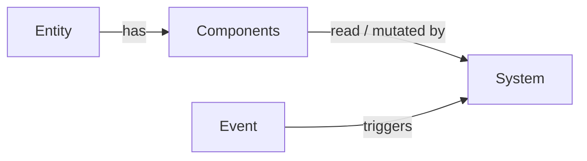

# Entity-Component-System

SampSharp is built on the **Entity-Component-System** (ECS) architecture. Every gamemode you write organizes its logic into three concepts:

- **Entities** — unique identifiers for things in the game world (a player, a vehicle, a custom item).
- **Components** — data attached to entities (a `Player`'s `Position`, a `BankAccount` you defined).
- **Systems** — logic that operates on entities by reading their components and responding to events.

Rather than deep class inheritance, ECS uses **composition**: you build complex entities by attaching whichever components they need.

## How the pieces fit together

When events arrive, the dispatcher passes the relevant components from the involved entities into your system methods — you do not query for components directly.

### Example: a player picks up an item

1. open.mp fires a pickup event.
2. A system receives the `Player` and `Pickup` components.
3. The system updates the player's inventory based on the pickup data.
4. The system removes the pickup entity.

### Example: a player exits a vehicle

1. open.mp fires a vehicle exit event.
2. A system receives the `Player` and `Vehicle` components.
3. The system calculates a fare based on distance traveled and gives money to the player.
4. The system logs the ride for statistics.

