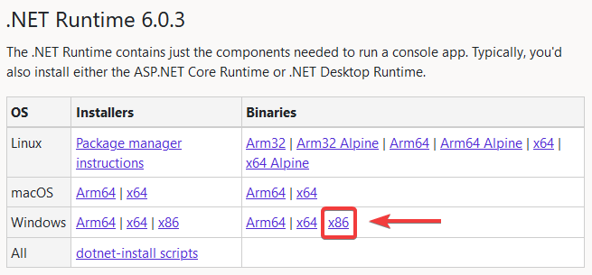
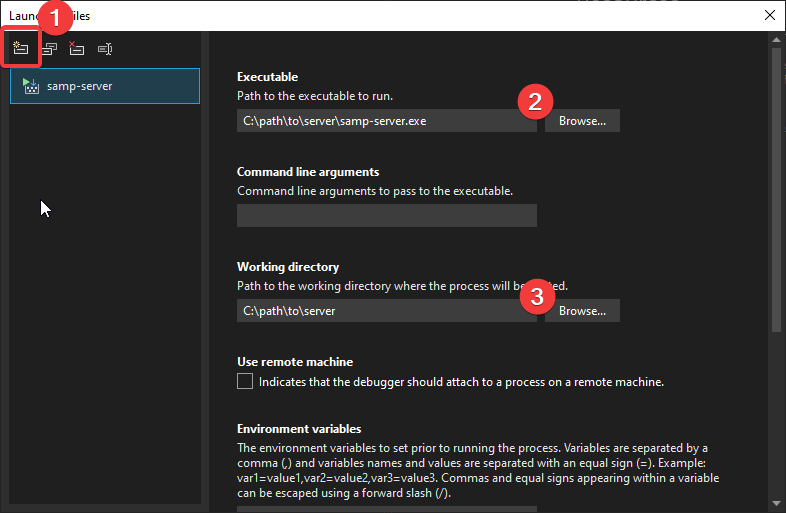
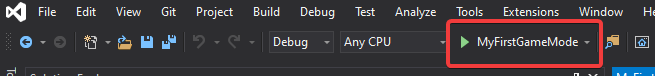
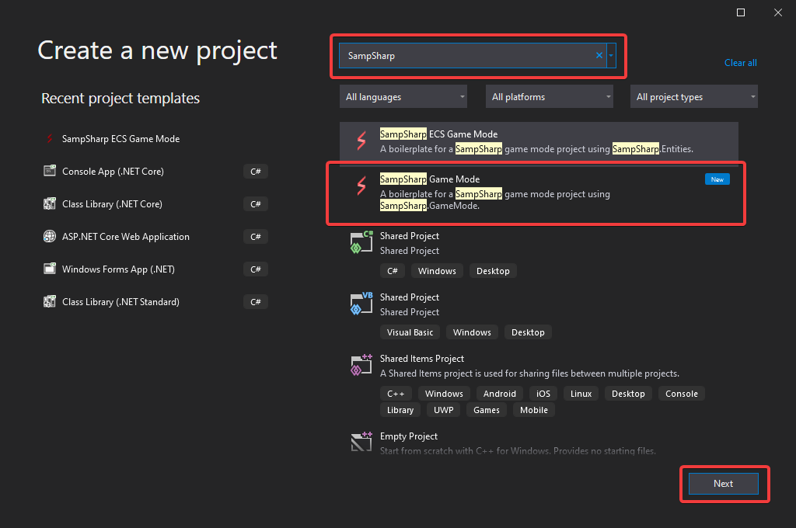

## Overview
This guide explains how to configure and debug legacy SampSharp (v0.x) for SA-MP servers. It covers setting up the plugin, .NET runtime, and Visual Studio for starting and debugging your game mode. These instructions are for legacy SampSharp only.

## Prerequisites
You will need:
- [Visual Studio](https://visualstudio.microsoft.com/downloads/) (2022 or newer, Community edition is free)
- [SA-MP Windows Server](https://sa-mp.mp/downloads/) (extract anywhere)

## Installing SampSharp Plugin and .NET Runtime
1. Download the latest `SampSharp-{version}.zip` from the [SampSharp releases page](https://github.com/ikkentim/SampSharp/releases/latest) and extract to your SA-MP server directory.
2. Download the latest **x86 binaries release** of the .NET Runtime from the [.NET 6.0 download page](https://dotnet.microsoft.com/en-us/download/dotnet) and extract to a new folder named `runtime` in your SA-MP server directory.
  
3. Open `server.cfg` in your SA-MP server directory and update:
  - Add: `plugins SampSharp`
  - Set: `gamemode0 empty 1`
  - Remove: any `filterscripts` line
  - Set a secure `rcon_password`
  Example configuration:

- Download the latest `SampSharp-{version}.zip` from the [SampSharp releases page on GitHub](https://github.com/ikkentim/SampSharp/releases/latest) page and extract its contents to your SA-MP server directory
- Download the latest <u>x86 binaries release</u> of the .NET Runtime from the [.NET 6.0 download page](https://dotnet.microsoft.com/en-us/download/dotnet) and extract its contents to a new folder named `runtime` in your SA-MP server directory.  

- Open the `server.cfg` file in your SA-MP server directory with your favorite text editor and update the following values:
  - Add the line `plugins SampSharp`
  - Change the line starting with `gamemode0` to `gamemode0 empty 1`
  - Remove the line starting with `filterscripts`
  - Change the value after `rcon_password` to a secure password
  After making these changes, the configuration should look like like this:

```
echo Executing Server Config...
lanmode 0
rcon_password SuperSecretPassword
maxplayers 50
port 7777
hostname SA-MP 0.3 Server
gamemode0 empty 1
announce 0
chatlogging 0
weburl www.sa-mp.com
onfoot_rate 40
incar_rate 40
weapon_rate 40
stream_distance 300.0
stream_rate 1000
maxnpc 0
logtimeformat [%H:%M:%S]
language English
plugins SampSharp
```

## Setting Up Visual Studio for Debugging
You can use Visual Studio to build and debug your legacy SampSharp game mode:

1. Open Visual Studio and create a new project (using your preferred SampSharp template or existing project).
2. In Solution Explorer, right-click your project and select **Properties**.
3. Under **Build → Output**, set the **Base output path** to a new folder named `gamemode` inside your SA-MP server directory.
4. Under **Debug → General**, open the **Debug launch profiles UI**:
  - Create a new **Executable** profile
  - Set **Executable** to `samp-server.exe` in your SA-MP server directory
  - Set **Working directory** to your SA-MP server directory
  - (Optional) Remove the default project launch profile
  - (Optional) Rename your new profile

  

5. Click **Start Debugging** in Visual Studio to launch your SA-MP server with your SampSharp game mode attached.

  

- Open Visual Studio and create a new project
- In the 'Create a new project' dialog, search for the 'SampSharp Game Mode' project template and click on Next
- Enter a project name, such as 'MyFirstGameMode' and click on Create  


You have now successfully created your game mode! In order to start your game mode with your server, you need to change some properties in your project. 
- Right click your projects in the 'Solution Explorer' and select 'Properties'.
- Under 'Build' -> 'Output', change the 'Base output path' value using the 'Browse'-button to a new folder named `gamemode` in your SA-MP server directory
- Under 'Debug' -> 'General' click on 'Open debug launch profiles UI'
  - Create a new 'Executable' profile
  - Set 'Executable' to the 'samp-server.exe' in your SA-MP server directory
  - Set the 'Working directory' to your SA-MP server directory
  - (optional) Remove the default 'project' launch profile
  - (optional) Rename your new profile


By clicking the 'Start Debugging' button in Visual Studio, you will now start your game mode in your SA-MP server


