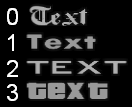

Introduction
------------
SampSharp supports both SA:MP textdraws type: global textdraws and player textdraws.

| SampSharp class | Description                                             |
| --------------- | ------------------------------------------------------- |
| `TextDraw`      | `Same textdraw for all players`                         |
| `PlayerTextDraw`| `Personalized textdraw for each player`                 |

> **Note!** All the methods, properties and events are the same between TextDraw and PlayerTextDraw class.

See https://open.mp/docs/scripting/resources/textdraws for more information.

Creating a textdraw
----------------
Creating a textdraw is pretty simple, first you have to initialize a TextDraw object (or PlayerTextDraw depending on what you need):
``` c#
// GameMode.cs
public class GameMode : BaseMode
{
    // Create your Global Textdraws on the Gamemode init !
    public static TextDraw td_discord;
    protected override void OnInitialized(EventArgs e)
    {
        base.OnInitialized(e);

        //Global Textdraw
        var tdPos = new Vector2(110.0, 405.0);
        td_discord = new TextDraw(tdPos, "Join the discord: discord.gg/yourinvite");
    }
}

// Player.cs
public class Player : BasePlayer
{
    public override void OnConnected(EventArgs e)
    {
        base.OnConnected(e);

        // Get the Global Textdraw creating during Gamemode init and show it
        GameMode gm = (GameMode)BaseMode.Instance;
        gm.td_discord.Show(this);

        //Player Textdraw
        var ptdPos = new Vector2(450.0, 50.0); // Set your TextDraw position here (x, y)
        var myPlayerTD = new PlayerTextDraw(this, ptdPos, "XP: 45/50");
    }
}
```
> **Note!** The position should be in the range: `0 < x < 640` and `0 < y < 480`

> Position (0, 0) is top-left corner

Signatures:
``` c#
// Global Textdraw
public TextDraw()
public TextDraw(Vector2 position, string text)
public TextDraw(Vector2 position, string text, TextDrawFont font)
public TextDraw(Vector2 position, string text, TextDrawFont font, Color foreColor)

// Player Textdraw
public PlayerTextDraw(BasePlayer owner)
public PlayerTextDraw(BasePlayer owner, Vector2 position, string text)
public PlayerTextDraw(BasePlayer owner, Vector2 position, string text, TextDrawFont font)
public PlayerTextDraw(BasePlayer owner, Vector2 position, string text, TextDrawFont font, Color foreColor)
```

Displaying a textdraw
----------------
Once your textdraw (or player textdraw) is created, you need to call the `.Show()` method to display it to players.
To display a textdraw to all players, just call `.Show()` method without params, otherwise you can add the player to whom you want to display it `.Show(player)`.

Signatures:
``` c#
// Global Textdraw
TextDraw.Show() // Displays this textdraw to all players.
TextDraw.Show(BasePlayer player) // Displays this textdraw to the given player.

// Player Textdraw
PlayerTextDraw.Show() // Displays this player textdraw to the owner of this textdraw.
```

To hide a textdraw, do the same with `.Hide()` method !

Fonts
----------------
ID  |    SampSharp constant       |	                         Info                                  | Tips
--- | --------------------------- | -------------------------------------------------------------- | ----------------------------------------------
0   | `TextDrawFont.Diploma`      |	The San Andreas Font.                                          |	Use for header or titles, not a whole page.
1   | `TextDrawFont.Normal`       |	Clear font that includes both upper and lower case characters. |	Can be used for a lot of text.
2   | `TextDrawFont.Slim`         |	Clear font, but includes only capital letters.                 |	Can be used in various instances.
3   | `TextDrawFont.Pricedown`    |	GTA font                                                       |	Retains quality when enlarged. Useful for large texts.
4   | `TextDrawFont.DrawSprite`   | Used to draw game sprites                                      | See [Drawing sprite](#drawing-sprite)
5   | `TextDrawFont.PreviewModel` | Used to display preview model                                  | See [Drawing model](#drawing-model)

Textdraw fonts:



> **Note!** Fonts appear to look the best with an X to Y ratio of 1 to 4 (e.g. if x = 0.5 then y should be 2). 

Drawing sprite
----------------
To draw a game sprite, the text must be set according the format: `library:texture`.
The libraries are taken from those directories: `<SA Dir>/models/txd/` and `<SA Dir>/SAMP/`.

For exemple, the following code is drawing :
``` c#
var tdPos = new Vector2(110.0, 205.0);
var td = new TextDraw(tdPos, "LD_BEAT:up");
td.Width = 20;
td.Height = 20;
td.Font = TextDrawFont.DrawSprite;
td.Show(player);
```

> **Note!** If you want to change the font of a textdraw that is already shown, you have to hide it and show it again to apply the modification. 

Drawing model
----------------
To draw a game model you need to set the font to `TextDrawFont.PreviewModel`, add a box and set the property `PreviewModel` to the model id you want to display.

Example:
``` c#
var tdPos = new Vector2(110.0, 205.0);
var td = new TextDraw(tdPos, "_");
td.Width = 50;
td.Height = 50;
td.Font = TextDrawFont.PreviewModel;
td.UseBox = true;
td.BoxColor = Color.Red;

// To display an Infernus:
td.PreviewModel = 411;
// To display CJ Skin:
td.PreviewModel = 1;
// To display police light object:
td.PreviewModel = 18646;

// Setting model rotation and zoom (optional)
td.PreviewRotation = new Vector3(-10.0, 0.0, -20.0);
td.PreviewZoom = 0.7f;

// Setting model color (optional, for vehicles only)
td.PreviewPrimaryColor = 5;
td.PreviewSecondaryColor = 32;

td.Show(player);
```

Clickable Textdraws
----------------

First, the textdraws are not clickable by default, set the textdraws you want to be selectable with `.Selectable = true`.
``` c#
var tdPos = new Vector2(110.0, 205.0);
td = new TextDraw(tdPos, "LD_BEAT:up");
td.UseBox = true;
td.BoxColor = Color.Red;
td.Width = 20;
td.Height = 20;
td.Font = TextDrawFont.DrawSprite;
td.Selectable = true;
td.Show(this);
```
Then you need to set the client in select mode:
``` c#
public class Player : BasePlayer
{
    [Command("tdselect")]
    private void TDSelectCommand()
    {
        var hoverColor = Color.Green;
        this.SelectTextDraw(hoverColor);
    }
}
```

Once the client is in select mode, the following events will be enabled:
* `ClickTextDraw`
* `ClickPlayerTextDraw`
* `CancelClickTextDraw` (called when the player press ESC key)

``` c#
public class Player : BasePlayer
{
    public override void OnClickTextDraw(ClickTextDrawEventArgs e)
    {
        base.OnClickTextDraw(e);
        this.SendClientMessage("You clicked on textdraw: " + e.TextDraw.Text);
        this.CancelSelectTextDraw();
    }

    public override void OnClickPlayerTextDraw(ClickPlayerTextDrawEventArgs e)
    {
        base.OnClickPlayerTextDraw(e);
        this.SendClientMessage("You clicked on player textdraw: " + e.PlayerTextDraw.Text);
        this.CancelSelectTextDraw();
    }

    public override void OnCancelClickTextDraw(PlayerEventArgs e)
    {
        base.OnCancelClickTextDraw(e);
        this.SendClientMessage("You cancelled the textdraw selection");
    }
}
```

At any moment, you can cancel select mode with `Player.CancelSelectTextDraw()`:
``` c#
public class Player : BasePlayer
{
    [Command("tdunselect")]
    private void TDUnselectCommand()
    {
        this.CancelSelectTextDraw();
    }
}
```