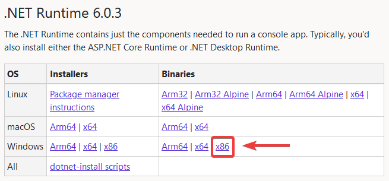
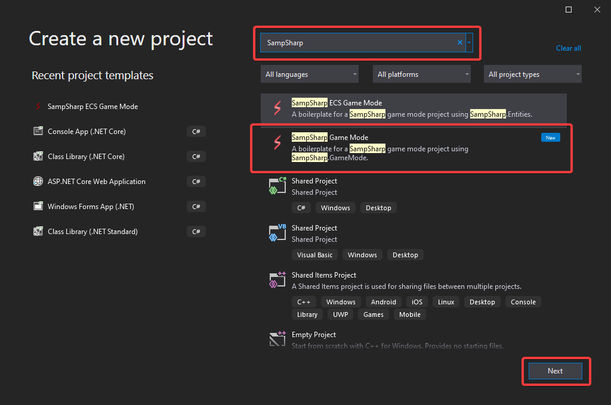
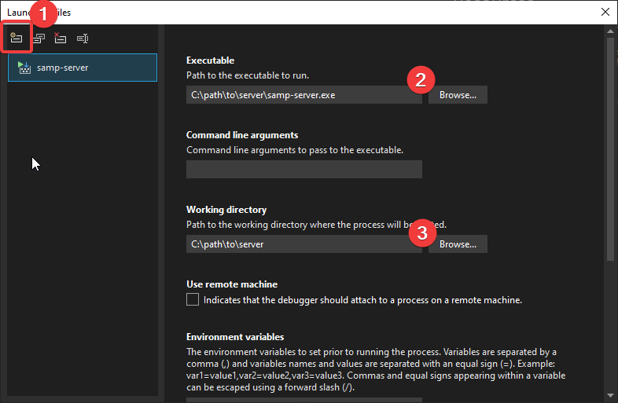
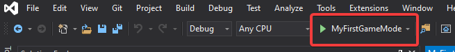

## Introduction
This guide will help you to to get your first SA-MP server up and running with your own SampSharp game mode. In this guide we will asume you are using Windows and will be using Visual Studio to develop your game mode.

## Prerequisites
Before we get started, you'll need to install the following things:
- [Visual Studio](https://visualstudio.microsoft.com/downloads/) (2022 or newer, the community edition is free for everyone)
- [SA-MP Windows Server](https://sa-mp.mp/downloads/) (extract it anywhere you like)

## Installing the SampSharp plugin
Using the following instructions you can install the SampSharp plugin and configure it for running your first game mode.

- Download the latest `SampSharp-{version}.zip` from the [SampSharp releases page on GitHub](https://github.com/ikkentim/SampSharp/releases/latest) page and extract its contents to your SA-MP server directory
- Download the latest <u>x86 binaries release</u> of the .NET Runtime from the [.NET 6.0 download page](https://dotnet.microsoft.com/en-us/download/dotnet) and extract its contents to a new folder named `runtime` in your SA-MP server directory.  

- Open the `server.cfg` file in your SA-MP server directory with your favorite text editor and update the following values:
  - Add the line `plugins SampSharp`
  - Change the line starting with `gamemode0` to `gamemode0 empty 1`
  - Remove the line starting with `filterscripts`
  - Change the value after `rcon_password` to a secure password
  After making these changes, the configuration should look like like this:

```
echo Executing Server Config...
lanmode 0
rcon_password SuperSecretPassword
maxplayers 50
port 7777
hostname SA-MP 0.3 Server
gamemode0 empty 1
announce 0
chatlogging 0
weburl www.sa-mp.com
onfoot_rate 40
incar_rate 40
weapon_rate 40
stream_distance 300.0
stream_rate 1000
maxnpc 0
logtimeformat [%H:%M:%S]
language English
plugins SampSharp
```

## Creating a game mode project
It is now time to create your first game mode project. To make things easier, we've created a template for getting started with your first game mode. You can download the [SampSharp Templates for Visual Studio](https://marketplace.visualstudio.com/items?itemName=ikkentim.sampsharptempltes) from the Visual Studio marketplace webpage or using the extension manager in Visual Studio.

- Open Visual Studio and create a new project
- In the 'Create a new project' dialog, search for the 'SampSharp Game Mode' project template and click on Next
- Enter a project name, such as 'MyFirstGameMode' and click on Create  


You have now successfully created your game mode! In order to start your game mode with your server, you need to change some properties in your project. 
- Right click your projects in the 'Solution Explorer' and select 'Properties'.
- Under 'Build' -> 'Output', change the 'Base output path' value using the 'Browse'-button to a new folder named `gamemode` in your SA-MP server directory
- Under 'Debug' -> 'General' click on 'Open debug launch profiles UI'
  - Create a new 'Executable' profile
  - Set 'Executable' to the 'samp-server.exe' in your SA-MP server directory
  - Set the 'Working directory' to your SA-MP server directory
  - (optional) Remove the default 'project' launch profile
  - (optional) Rename your new profile




By clicking the 'Start Debugging' button in Visual Studio, you will now start your game mode in your SA-MP server



## Choose your framework
SampSharp provides two frameworks for creating your gamemodes, SampSharp.GameMode and SampSharp.Entities. You can choose to build your game mode on top of one of the frameworks. Using the instructions above, you have created a SampSharp.GameMode game mode.

Both frameworks are fully featured and provide tools, types and functions for using all functionality provided by SA-MP. They also provide tools allowing you to easily create player commands.

### SampSharp.GameMode
SampSharp.GameMode is the first framework created for SampSharp and has been availble since the early days of SampSharp.

**Benefits**
- Easy to understand, simple enough for people who are new to C#
- A simple object-oriented types for all SA-MP types such as players, vehicles, objects, etc.

You can create a SampSharp.GameMode game mode using the 'SampSharp Game Mode' project template.

### SampSharp.Entities
The SampSharp.Entities framework has been created to solve a number of issues which could make life more difficult with SampSharp.GameMode.

**Benefits**
- Entity-Component-System structure for building your gamemodes:
  - Easily associate data with entities (players/vehicles/etc.) without having to create and keep track of association dictionaries
  - Easily extend existing entities with custom data using components
  - A simple and clear-cut way of organizing your code by responsibility using systems
- Components for all SA-MP types such as players, vehicles, objects, etc.
- Dependency injection

You can create a SampSharp.Entities game mode using the 'SampSharp ECS Game Mode' project template.